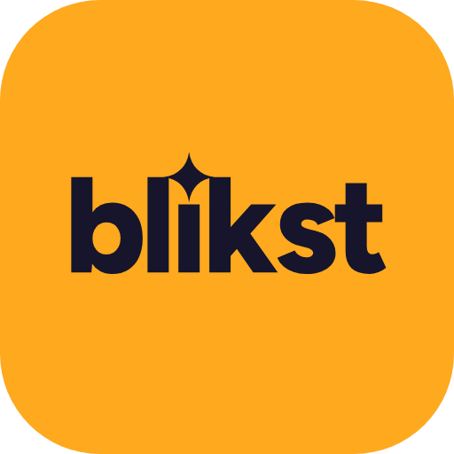

# Blikst

Get quotes from tradespeople and local services in Norway, right in the conversation with Claude. Describe the job and where it is, and [Blikst](https://blikst.no) sends your request to up to three companies that suit the job and the place. They contact you with their quotes, and you decide whether to accept one. You do not have to compare or choose companies yourself.

Blikst covers about 90 kinds of work for homes, cabins and businesses: electricians, plumbers, carpenters, painters, roofers, tilers, bathroom and kitchen renovation, heat pumps and solar panels, gardeners, tree felling and snow clearing, cabin care, cleaning, moving, locksmiths, pest control and property surveyors, and business services such as accountants, lawyers, IT and marketing. It covers jobs in Norway only.

## Use it

Ask Claude in Norwegian or English, for example:

- "Jeg trenger en elektriker til å montere elbillader i Oslo. Kan du skaffe tilbud?"
- "Get me quotes for snow clearing at our cabin in Geilo."
- "Which companies can stain a cabin in Hemsedal?"
- "Has anyone received my request yet?"

Claude finds the kind of job, then opens Blikst's request form filled in with the job and the place. You type your own name, phone number and e-mail in the form, agree to Blikst's privacy policy and send it. Nothing is sent before you send the form. Where Claude cannot show the form, as in Claude Code, Claude asks for the same details in the chat, shows you what will be sent and asks for your agreement first.

If you would rather see who is there, ask which companies Blikst lists for the job and the place. Blikst shows them as cards with their services, areas, organisation number and website, and you can ask one of them for a quote.

## What the plugin contains

- `skills/get-quotes`: a skill that tells Claude when Blikst fits and the order to use its tools in.
- `.mcp.json`: a reference to Blikst's remote MCP server at `https://blikst.no/api/mcp`. It needs no account or API key.

The plugin runs no code on your computer, installs no packages and sets no hooks.

### Tools on the MCP server

| Tool | Kind | What it does |
| --- | --- | --- |
| `find_services` | read | Turns the job, in your words, into Blikst's kinds of work, and says when Blikst does not cover a job. |
| `find_service_providers` | read | Shows up to eight companies Blikst lists for the job and the place, as cards. |
| `get_service_provider` | read | Tells about one of those companies: services, areas, description, organisation number and website. |
| `request_service` | read | Opens the request form, filled in with the job and the place. It sends nothing. |
| `send_quote_request` | write | Sends your request to Blikst, which passes it to up to three companies. |
| `get_request_status` | read | Tells whether your request has been sent and which companies have it. |

## Data

- **What is sent to Blikst:** what Claude passes to the tools, such as the job, the place and the kind of work. When you send a request: your first and last name, phone number, e-mail, the postal code and place of the job, the description of the job, and that you agreed to the privacy policy.
- **Who gets your request:** up to three companies that can take the job in that place. They use your details to contact you with quotes.
- **What Blikst keeps:** requests are kept as described in the [privacy policy](https://blikst.no/personvern), 12 months from sending. To improve the service, Blikst logs each tool call: the tool, the search words, the kind of work, the place, the number of results and whether a request was sent. The log never holds your name, contact details, job description, IP address or any user id, and the search words are deleted after 90 days.
- **What Blikst never gives out:** companies' phone numbers or e-mail addresses, and which companies Blikst works with.
- Blikst does not read your conversation, your files or your memory, only what Claude passes to its tools. What you type in the chat itself is also processed by Anthropic under its own terms.

Privacy policy: https://blikst.no/personvern (Norwegian). Terms: https://blikst.no/vilkar.

## Support

Write to support@blikst.no or use the help section at https://blikst.no/#hjelp.

## License

MIT. See [LICENSE](./LICENSE).
